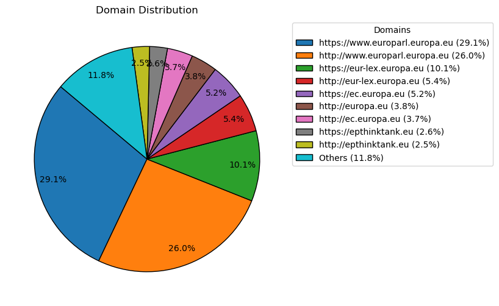
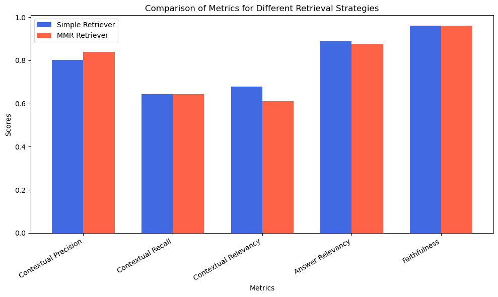

# Diversified Answer Generation QA System

This repository contains the code and results of the Master Practical "Data Science and NLP" on the topic "Diversified Answer Generation QA System" supervised by Ashish Chouhan in WS2024/25. 

Author: Mara-Eliana Popescu

### Setup

To set up the Conda environment for this project, run the following commands in your terminal:

```sh
conda env create -f environment.yml
conda activate qa_system
```

Rename the .env-example to .env and populate the file with the required credentials:
```sh
# Opensearch Connection Details
OPENSEARCH_USER = "your_opensearch_username"
OPENSEARCH_PASSWORD = "your_opensearch_password"
# OpenAI
OPENAI_API_KEY = "your_openai_key"
```

## Table of Contents
- [Introduction](#introduction)
- [Project Structure](#project-structure)
- [Data Collection](#data-collection)
- [RAG System](#rag-system)
- [RAG Evaluation](#rag-evaluation)
- [Conclusions and Future Work](#conclusions-and-future-work)
- [References](#references)

## Introduction

Traditional Question Answering (QA) systems aim to provide highly precise responses, often yielding a single correct answer. However, in many domains, questions can have multiple valid perspectives and require diversified answers that cover various topics and viewpoints rather than a single definitive response. This is particularly relevant in open-ended or subjective queries, where different aspects of a topic contribute to a more comprehensive understanding.

To address this challenge, this project focuses on developing a QA system capable of generating diversified answers by leveraging a Retrieval-Augmented Generation (RAG) pipeline. **Diversification** in retrieval systems can be formally defined as the process of optimizing retrieved results to maximize coverage across distinct aspects, topics, or viewpoints relevant to a given query, rather than reinforcing a single dominant perspective. This definition aligns with our goal of producing QA outputs that are not only accurate but also contextually rich and representative of multiple perspectives.

A crucial aspect of this project is the dataset used to assess the system's capability to generate diversified answers. The primary dataset consists of blog posts from Ask EP, which provide a strong example of diversified QA pairs. Unlike traditional QA datasets that map each question to a single correct answer, Ask EP responses tend to explore multiple angles, offering nuanced perspectives that make them particularly well-suited for studying diversification in answer generation. By analyzing how language models interact with such data, we can assess whether they tend to focus on a single topic or viewpoint or if they are capable of constructing a panoramic response covering a broad range of relevant information.

The ability to generate diversified answers is critical in domains such as legal advice, policy discussions, and scientific discourse, where presenting multiple perspectives enhances decision-making. The objectives of this project include:

- Creating a custom diversified QA dataset.
- Building a knowledge base to support diversified answer generation.
- Implementing a RAG pipeline for diversified QA.
- Evaluating the system, with a focus on diversification.

By improving diversification in answer generation, this project contributes to the broader goal of making QA systems more informative, balanced, and context-aware.

## Project Structure
| **Category**          | **File Name**               | **Purpose / Description**                      |
|------------------|------------------------|--------------------------------------------|
| **Data Collection** | `scraper.py`           | Loads, processes and stores urls and qa dataset           |
|                  | `scrape_external_links.py`| Collects a list of all external urls    |
|                  | `clean_external_links.py` | Cleans the list of external urls           |
|                  | `analyse.ipynb`           |   Analysis of domain distribution and separation of urls   |
|                  | `utils.py`               | Contains OpenSearch utility functions                                          |
|                  |  `index_non_pdfs.py`     | Scrapes, processes and stores webpages for knowledge base|
|                  |  `index_pdfs.py`         | Scrapes, processes and stores pdfs for knowledge base|
|                  |  `test_crawl4ai.py`      | Tests the scraping capabilities of Crawl4AI|
| **RAG Pipeline** | `rag_pipeline.py`         | Constructs a full RAG system             |
|                  | `reindex.ipynb`           | Reindices documents for vector search and tests similarity search  |
| **Evaluation**   | `compute_diversity_metric.ipynb`| Implements $\alpha$-nDCG |
|                  | `deep_eval.ipynb`         | Evaluates classic metrics using DeepEval  |
|                  |  `evaluate_ragas.py`      | Evaluates classic metrics using RAGAS  |


## Data Collection
### QA Dataset

#### Data Source
The dataset consists of blog posts from [Ask EP](https://epthinktank.eu/author/epanswers/), where European citizens pose questions on various topics such as climate policies, elections, healthcare, etc. and the European Parliament responds. These posts provide structured answers covering multiple viewpoints, making them suitable for a diversified QA dataset.

<p align="center">
  
  <p><em>Source: <a href="https://epthinktank.eu/2024/06/28/regulating-social-media-what-is-the-european-union-doing-to-protect-social-media-users/">Ask EP: Regulating social media: What is the European Union doing to protect social media users?</a></em></p>
</p>

#### Data Processing and Storage
To build the QA dataset, we started by scraping a list of URL addresses from the blog posts published by Ask EP. These URLs were stored in an OpenSearch index named `eur-lex-diversified-urls-askep`, with the following mapping:

```json
{
    "mappings": {
        "properties": {
            "url": {"type": "keyword"},
            "date": {"type": "date"}
        } 
    }
}
```

The date of publication for each blog post was extracted directly from its URL and stored in the index. Keeping track of the publication date is essential for efficiently updating the dataset. When new blog posts are published, we first retrieve the most recent date stored in the OpenSearch index and then load the URLs corresponding to this date. Next, we scrape all URLs from a more recent date, as well as any new URLs appearing on the same date but not yet indexed. This incremental updating process ensures that the dataset remains up to date with minimal redundant processing.

Once the list of the latest URLs is obtained, we proceed to crawl the corresponding HTML pages and store the extracted information in a separate OpenSearch index called `eur-lex-diversified-qa-askep`. Upon inspecting the HTML structure of the blog posts, we observed that, despite minor differences, all posts follow a fairly consistent format. This consistency allowed us to automate the extraction process using BeautifulSoup.

From each blog post, we extracted the following key pieces of information:
- The HTML content of the page
- The URL address
- The publication date
- The blog post title
- The formulated question
- The answer
- A multilingual flag (indicating whether the post contains content in multiple languages)
- A list of links present in the blog post
- A list of tags and their corresponding URLs

Extracting the question and answer presented unique challenges. In some cases, the question was explicitly stated in the blog post’s title, making extraction straightforward. However, in other instances, the title contained only keywords, while the actual question was formulated within the first paragraph of the blog post. Since no fixed rule could determine where the question was located, we employed an LLM (GPT-4) to analyze the title and first paragraph and decide which one best represented the question. This approach significantly improved accuracy and consistency in question extraction.

The second challenge was defining the answer. Instead of treating the entire blog post as a single block of text, we opted to preserve its structure by segmenting the answer into distinct sections. Each section title was paired with its corresponding paragraph, and these pairs were stored in a dictionary format.

Furthermore, the `eur-lex-diversified-qa-askep` index was designed to contain only English-language content. If a blog post included multiple language versions, we set the multilingual flag to `True` while ensuring that only the English answer was stored. This decision was made to maintain consistency with the RAG system and evaluation pipeline, which both operate exclusively in English. As of now, the index contains 192 documents.

In addition to indexing content in OpenSearch, the latest version of our scraping script also stores extracted data (excluding HTML pages) locally in separate files. This local storage was implemented primarily for debugging purposes, allowing us to verify the correctness of the extraction process and easily retrieve lists of external links from all blog posts when needed.

### Knowledge Base

The knowledge base for our RAG pipeline is built from external web pages linked within Ask EP blog posts. Initially, we collected all external links and performed a cleaning process, where duplicates, invalid URLs (not starting with `http`), YouTube, and `mailto` links were removed.

Next, we analyzed the domains of the cleaned URLs to understand their origins, as visualized in the image below. A majority of the URLs pointed to official European Union institutional websites. The content of these linked pages primarily consists of legal documents and news reports, which influenced our choice of embedding models, favoring those specialized for the legal domain.

<p align="center">
  
</p>

Before extracting textual content, we categorized the URLs into two groups: those linking to PDFs and those linking to standard web pages. Initially, we assumed that all PDF URLs would have a `.pdf` extension, but this led to false negatives. To address this, we checked for PDF MIME types within the HTML page metadata, which allowed us to correctly identify PDFs. In total, we gathered **1668 non-PDF URLs** and **135 PDF URLs**, while 361 URLs resulted in HTTP errors, mainly `404` (Not Found) and `403` (Forbidden).

For extracting text from non-PDF pages, we used **BeautifulSoup**, as it efficiently parses HTML content. For PDF documents, we employed [**MarkItDown**](https://github.com/microsoft/markitdown), a tool that converts PDFs into Markdown format while preserving tabular data. This was particularly beneficial, as **87 out of the 135 PDFs** contained tables, and identifying them was done using **pdfplumber** rather than manual verification.

We initially considered using [**Crawl4AI**](https://github.com/unclecode/crawl4ai) for scraping, but it proved to be slower than BeautifulSoup. Since our focus was strictly on text extraction, we opted for the simpler and faster alternative.

Once the text was extracted, we proceeded with chunking and embedding the documents. We experimented with two embedding models:
- **Closed-source:** [`text-embedding-3-small`](https://platform.openai.com/docs/guides/embeddings) (OpenAI)
- **Open-source:** [`mxbai-embed-large`](https://ollama.com/library/mxbai-embed-large) (via Ollama)

Although neither model was specifically trained for legal documents, OpenAI’s model ranked **14th** for legal tasks on the [**MTEB (Law, v1) leaderboard**](https://huggingface.co/spaces/mteb/leaderboard) (February 2025). The **mxbai-embed-large** model had achieved **state-of-the-art performance for BERT-large models** on MTEB in March 2024, making it a strong generalist model across domains.

Ultimately, we selected OpenAI’s embedding model due to its high-quality embeddings and efficiency. While not free, embedding all documents cost only **$0.40** and completed in **under 2.5 hours**. By contrast, the open-source model required **12+ hours** to process **60%** of the dataset when run locally.

Additionally, OpenAI’s model had advantages in token capacity and embedding dimension:
- **Max tokens:** **8191** (OpenAI) vs. **512** (mxbai-embed-large)
- **Embedding dimension:** **1536** (OpenAI) vs. **1024** (mxbai-embed-large)

For text splitting, we evaluated two LangChain strategies:
- **SentenceTransformersTokenTextSplitter** (aligned with tokenizer, but limited to 384 tokens per chunk)
- **RecursiveCharacterTextSplitter** (allows larger chunks)

Due to the restrictive chunk size of the first approach, we opted for **RecursiveCharacterTextSplitter**, settling on **6000-character chunks** with a **200-character overlap** to optimize retrieval.

Following chunking and embedding, we indexed the documents into OpenSearch under `eur-lex-diversified-knowledge-base-3`. This index stores **14,914 documents** with the following mapping:
```json
{
    "mappings": {
        "properties": {
            "url": {"type": "keyword"},
            "chunk_id": {"type": "integer"},
            "text": {"type": "text", "fielddata": false},
            "embedding": {"type": "knn_vector", "dimension": 1536}
        }
    }
}
```

We initially encountered a **circuit_breaking_exception** after indexing **99%** of the documents, caused by `fielddata` being set incorrectly. Moving the indexed data into a new index with `fielddata: false` resolved this issue. We also ensured compliance with OpenAI’s rate limits (1M tokens/min, 3K requests/min) by monitoring and throttling requests when necessary.

## RAG System
### Retrieval Strategies
To evaluate different retrieval approaches, we experimented with two distinct strategies:

1. **Simple Retriever** - This approach utilizes OpenSearch’s default **HNSW algorithm** for k-nearest neighbors (k-NN) retrieval, providing a straightforward and efficient method for retrieving relevant documents.


2. **Maximum Marginal Relevance (MMR) Retriever** - This strategy balances relevance with diversity by selecting documents that are both similar to the query and dissimilar from already selected documents. The selection process follows the MMR formula (Carbonell & Goldstein, 1998):
$$
MMR(D_i) = \arg\max_{D_i \in R \setminus S} [\lambda \text{Sim}(D_i, Q) - (1 - \lambda) \max_{D_j \in S} \text{Sim}(D_j, D_i)]
$$

where:

$$
\begin{aligned}
MMR(D_i) & : \text{Maximum Marginal Relevance score for document } D_i. \\
\arg\max & : \text{Determines the document that maximizes the expression.} \\
D_i \in R \setminus S & : \text{Candidate documents that belong to the full set } R \text{ but are not yet included in the selected set } S. \\
\lambda & : \text{Trade-off parameter between relevance and diversity } (0 \leq \lambda \leq 1). \\
\text{Sim}(D_i, Q) & : \text{Similarity between document } D_i \text{ and the query } Q. \\
\max_{D_j \in S} \text{Sim}(D_i, D_j) & : \text{Maximum similarity between } D_i \text{ and any document } D_j \text{ in the selected set } S.
\end{aligned}
$$

By implementing and comparing these two retrieval strategies, we aimed to assess the impact of diversified retrieval on the performance of our RAG pipeline.


### Answer Generation

### Generation

In the generation phase of our RAG pipeline, we start by loading ground truth question-answer pairs from the OpenSearch index. For each ground truth question, we retrieve **k=3** relevant documents and use **GPT-4o-mini** to generate an answer based on the retrieved content. 

To explicitly encourage diversification, we incorporate specific instructions in the prompt, directing the generative model to focus on multiple topics or viewpoints. Below is the prompt used for answer generation:

```plaintext
Question: {question}
The following documents provide relevant information: {context}
Please answer the question only by using the provided information. Make sure to provide a diversified response that covers different
perspectives and details from the provided documents. Your answer should include multiple viewpoints and insights from the context, not
just a single perspective. If necessary, highlight different interpretations, opinions, or additional context that is relevant to the question.
```

We generate two distinct sets of answers, each corresponding to one of the retrieval strategies. For the **MMR retriever**, we set the hyperparameter **λ = 0.5**, ensuring a balance between novelty and relevance in document selection.

Below is an example showcasing a ground truth question along with the corresponding answers:

**Ground Truth Question**: Citizens are calling on the European Parliament to prioritize the End the Cage Age European citizens’ initiative in its legislative work.

| **Answer Type**            |
|----------------------------|
| **Ground Truth Answer**   |
| Citizens are calling on the European Parliament to prioritize the End the Cage Age European citizens’ initiative in its legislative work. As the European Commission postponed its proposal on cage-free farming initially due at the end of 2023, many people have written to the European Parliament on this subject since July 2024. We replied to those who took the time to write to the European Parliament (in Italian, Dutch, Spanish, English, French, Portuguese, and German). The European Parliament has regularly addressed the issue of animal welfare. In a 2021 resolution, Parliament called on the European Commission to propose a law to phase out the use of cages on EU farms, with the aim of ending cage-farming by 2027, following up the European citizens’ initiative ‘End the Cage Age’. Parliament also set up a committee of inquiry on the protection of animals during transport. In January 2022, Parliament then called on the Council of the EU and the Commission to strengthen the protection of animals during transport within and outside the EU. Members of the European Parliament have repeatedly asked the Commission to explain why it has not put forward a proposal on cage-free farming. In January 2024, the Commission replied that the transition to cage-free systems requires further consultations concerning the costs and the length of the transitional period. In March 2024, a Commissioner told Parliament that work was continuing on the follow-up to the End the Cage Age initiative. It is the Commission’s role to propose new laws. However, Parliament assesses the measures taken by the Commission in response to a European citizen’s initiative. We would add that Parliament is expected to continue work on two legislative proposals on animal welfare that the Commission presented in December 2023. In response to the work of Parliament’s committee of inquiry, the first proposal aims to strengthen EU rules on the protection of animals during transport. The second introduces new rules on the welfare and traceability of dogs and cats, with requirements for breeders, shelters, and pet shops. |
| **Generated Answer (Simple Retriever)** |
|The "End the Cage Age" initiative is a European Citizens' Initiative (ECI) aimed at phasing out the use of cage systems for farmed animals across the EU. Submitted on October 2, 2020, the initiative gathered significant support, with over 1.39 million validated statements of support from citizens across all EU Member States. This initiative notably emphasizes the welfare of millions of farm animals, as it seeks to address the conditions in which they are kept, with many currently confined to cages for the majority of their lives. The European Parliament publicly debated and expressed its support for the initiative on June 10, 2021. The Parliament's resolution highlighted that 82% of EU citizens feel that the welfare of farmed animals should be better protected. The European Commission responded to the initiative with a Communication on June 30, 2021, indicating its commitment to table a legislative proposal by the end of 2023 that would aim to phase out cage systems. However, challenges remain in the transition process, including financial costs and adaptation for farmers. |
| **Generated Answer (MMR Retriever)** |
|The European Citizens' Initiative (ECI) titled "End the Cage Age" aims to phase out the use of cages for various farm animals in the European Union.This initiative was submitted on October 2, 2020, and garnered substantial support, with over 1.39 million statements of support collected. The European Parliament and the European Commission have engaged with the initiative extensively since its submission. A public hearing was held on April 15, 2021, and the initiative was debated in the European Parliament on June 10, 2021. The European Commission outlined plans to introduce a legislative proposal by the end of 2023, contingent upon assessments from the European Food Safety Authority (EFSA) and public consultation outcomes. Despite the expressed commitment to legislative reforms, challenges in the practical implementation of these initiatives were noted. The impact assessment currently undertaken by the Commission aims to address the transition to cage-free systems effectively, considering environmental enrichment for animals and the economic implications for farmers. The Commission has also indicated plans for support measures, recognizing that the shift to cage-free systems must be accompanied by economic support to mitigate potential negative impacts on farmers. The strong citizen support underscores the demand for legislative action, while the discussions within the Parliament highlight the complexities involved in enacting such changes. |


## RAG Evaluation

#### Diversification Metrics

One of the key challenges in evaluating our RAG pipeline is the absence of standardized metrics for measuring diversification. Existing evaluation frameworks such as **RAGAS** and **DeepEval** do not explicitly assess diversification in retrieval or generation.

To address this gap, we explored **alpha-nDCG**, a metric that evaluates document relevance for multiple intents associated with a query. Since available implementations of alpha-nDCG are limited and often lack clear usage guidelines, we implemented our own version by referencing the original paper and its description in the Encyclopedia of Database Systems (Clarke et al., 2008; Sakai, 2018).

α-nDCG is a variant of Normalized Discounted Cumulative Gain (nDCG) designed for evaluating diversified search results. It assumes that a query $q$ can have multiple possible intents $i$ with known per-intent relevance assessments. Given a ranked list, let $I_i(r) = 1$ if the document at rank $r$ is relevant to intent $i$, and $ I_i(r) = 0 $ otherwise. Define the cumulative count of relevant documents for intent $ i $ at rank $ r $ as:

$$
C_i(r) = \sum_{k=1}^{r} I_i(k)
$$

For a given parameter $\alpha $ (typically 0.5), the novelty-biased gain at rank $ r $ is given by:

$$
ng(r)=\sum_{i} I_i(r) (1 - \alpha)^{C_i(r) - 1}
$$

This formulation reflects that a document's value is derived from the number of intents it covers. The α-nDCG at a given depth $ d $ is defined as:

$$
\alpha\text{-nDCG}@d = \frac{\sum_{r=1}^{d} \frac{ng(r)}{\log_2 (r+1)}}{\sum_{r=1}^{d} \frac{ng^*(r)}{\log_2 (r+1)}}
$$

where $ng^*(r)$ is the novelty-biased gain at rank $r$ of an ideal ranked list.

However, our implementation remains incomplete due to the need for computing an **ideal cumulative gain**, which is an **NP-complete problem**. The original paper suggests using greedy approximations, but practical details for implementing them are not clearly defined.

In our approach, we consider **subsection titles** from the answer field of each blog post as different **intents**. To construct the intent function $I_i(r)$ for an intent $i$ and document at rank $r$, we compute the **cosine similarity** between the embeddings of the intent and the document. If the similarity score exceeds a **0.5 threshold**, we assign it a value of $1$; otherwise, it is set to $0$. We then proceed according to the methodology outlined in the original alpha-nDCG definition.

#### Classic Metrics

Given the challenges of diversification evaluation, we also assessed our RAG pipeline using standard **retrieval and answer quality metrics**. We employed the [**DeepEval**](https://docs.confident-ai.com/) framework for evaluation, focusing on the following metrics:
- **Context Precision**
- **Context Recall**
- **Context Relevancy**
- **Answer Relevancy**
- **Faithfulness**

Initially, we attempted to use **RAGAS**, but encountered persistent **timeouts and rate-limit errors** that could not always be resolved. As a result, we transitioned to **DeepEval**, though the original RAGAS evaluation code remains in the repository for reference.

To limit costs, we evaluated the metrics on a **sample of 50 question-answer pairs** from the **192 ground truth QA pairs**. Below are the results for both retrieval approaches:



The table below presents the concrete averages of the performance metrics for the Simple Retriever and the MMR Retriever.

| Metric                  | Simple Retriever | MMR Retriever |
|-------------------------|-----------------|--------------|
| Contextual Precision   | 0.803333        | 0.840000     |
| Contextual Recall      | 0.643244        | 0.643308     |
| Contextual Relevancy   | 0.677705        | 0.610674     |
| Answer Relevancy       | 0.891988        | 0.876248     |
| Faithfulness           | 0.961027        | 0.959725     |

The MMR retrieval strategy improves precision by selecting more directly relevant documents but at the cost of lower contextual relevancy.
The Simple Retriever retrieves more contextually relevant documents, leading to slightly higher answer relevancy.


## Conclusions and Future Work

This project explored the creation of a diversified QA dataset and the development of a RAG system that promotes diversification at both the retrieval and generation levels. We examined various evaluation metrics, emphasizing diversification, and assessed our system using standard metrics.

While this work establishes a foundation for diversified QA, several key areas remain for further enhancement:

- **Clustering of Retrieved Documents**: A promising approach is to apply the clustering method proposed in recent work (Alessio et al., 2024).
 This would involve retrieving a larger number of documents, clustering them based on similarity, and then generating part of the final answer from each cluster. This approach could enhance the diversity of responses.
- **Search Result Diversification Techniques**: Investigating existing search result diversification methodologies could help refine retrieval strategies.
- **Development of a Custom Diversification Metric**: Current evaluation metrics do not fully capture the effectiveness of diversification. Designing a specialized metric tailored to diversified QA could provide more accurate assessments and drive further improvements.

By integrating clustering, advanced diversification strategies, and improved evaluation metrics, future work can enhance both the quality and comprehensiveness of generated responses.


## References
1. Sakai, T. (2018). α-nDCG. In L. Liu & M. T. Özsu (Eds.), *Encyclopedia of database systems*. Springer. https://doi.org/10.1007/978-1-4899-7993-3_80619-1

2. Clarke, C.L., Kolla, M., Cormack, G.V., Vechtomova, O., Ashkan, A., Büttcher, S., & MacKinnon, I. (2008). Novelty and diversity in information retrieval evaluation. Annual International ACM SIGIR Conference on Research and Development in Information Retrieval.

3. Alessio, M., Faggioli, G., Ferro, N., Nardini, F. M., & Perego, R. (2024). Improving RAG systems via sentence clustering and reordering. *CEUR Workshop Proceedings*, *3784*, 34–43. CEUR-WS. https://ceur-ws.org/Vol-3784/paper4.pdf

4. Carbonell, J. G., & Goldstein, J. (1998). The use of MMR, diversity-based reranking for reordering documents and producing summaries. Proceedings of the 21st Annual International ACM SIGIR Conference on Research and Development in Information Retrieval, 335–336. https://doi.org/10.1145/290941.291025